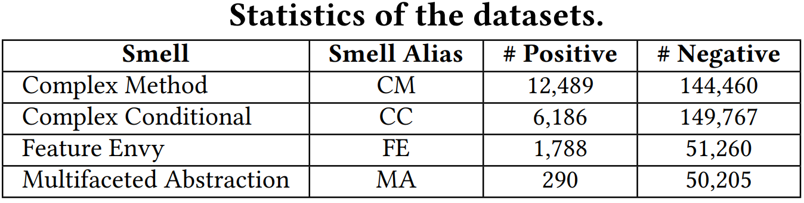

# **DeepSmellsFusion of deep convolutional and LSTM recurrent neural networks for automated detection of code smells**

## **Overview**
We introduced a new method called **DeepSmells** for detecting code smells using advanced deep learning techniques. Our technique involves converting the entire source code into tokens and indexing it before passing it through a 1D-CNN model to recognize the structured patterns. To enhance the quality of context encoding and preserve semantic information, we placed LSTMs right after the CNN. To decrease the impact of imbalanced data distribution, deep neural networks perform the final classification using a weighted loss function. We can identify four types of code smells, namely, Complex Method, Complex Conditional, Feature Envy, and Multifaceted Abstraction, by utilizing the datasets provided by Sharma et al. [1]. Our proposed approach was proven to be effective through an empirical evaluation using a real-world dataset. Additionally, we demonstrated that **DeepSmells** is more efficient in categorizing code smells when compared to an established baseline.

## **Dataset**


We utilized the datasets from the previous study [1], which included four types of code smells: Complex Method, Complex Conditional, Feature Envy, and Multifaceted Abstraction. The average rate of imbalance across all datasets was 5.24%

## **Execute**
We executed all of these models on the same benchmark datasets.

 - We re-run three different auto-encoder architectures: *AE-DNN*, *AE-CNN* and *AE-LSTM*. These architectures were previously introduced in a recent study by Sharma et al. [1] and showed promising results.
    
    ```
        cd /program
        cd /dl_models
        python autoencoder.py
    ```
 - Our proposed architecture *DeepSmells* and a variant called *DeepSmells-BiLSTM*.
    
    The hyperparameters can be configured in the run.sh file.
    ```
        cd /program
        cd /ease_deepsmells
        bash run.sh
    ```

## **References**
[1] Tushar Sharma, Vasiliki Efstathiou, Panos Louridas, and Diomidis Spinellis. 2021. Code smell detection by deep direct-learning and transfer-learning. Journal of Systems and Software 176 (2021), 110936.


